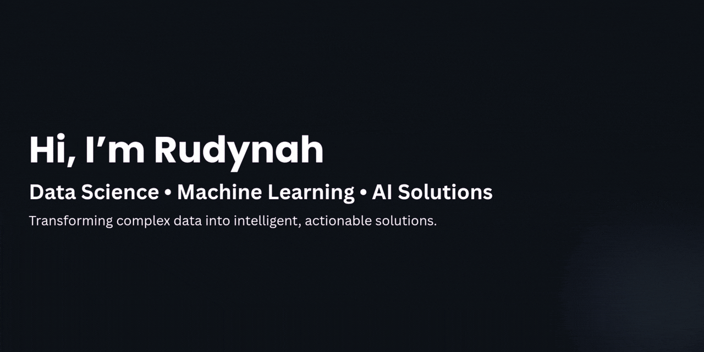

  

<h1 align="center">Hi 👋, I'm Rudaynah</h1>

  
  
  

  

## About Me

Aspiring Data Professional passionate about data analytics, Data Science, and data engineering, with hands-on experience in building full-stack applications, backend APIs, and data-driven solutions.
Currently building real-world data analytics projects and expanding my expertise in modern data technologies.

## Connect with Me

##  Featured Project

<table>
<tr>

<td width="140" align="center">

</td>

<td>

###  Modrik

**Bioinformatics Platform for Genetic Variant Interpretation**

A full-stack bioinformatics platform that interprets genetic variants from VCF files by integrating OpenCRAVAT, PanelApp, and trusted genomic resources, with optional AI-assisted explanations and expert consultation.

**Tech Stack:** Flutter • FastAPI • Firebase • MySQL • SQLite • OpenCRAVAT • PanelApp

<a href="https://github.com/itsrudaynah/Modrik">🔗 View Repository</a>

</td>

</tr>
</table>

## Tech Stack

### Programming Languages

---

### Data Analytics

---

### Data Visualization

---

### Machine Learning

---

### Backend Development

---

### Databases

---

### Mobile Development

---

### Design

---

### Computer Graphics

---

### Development Tools

